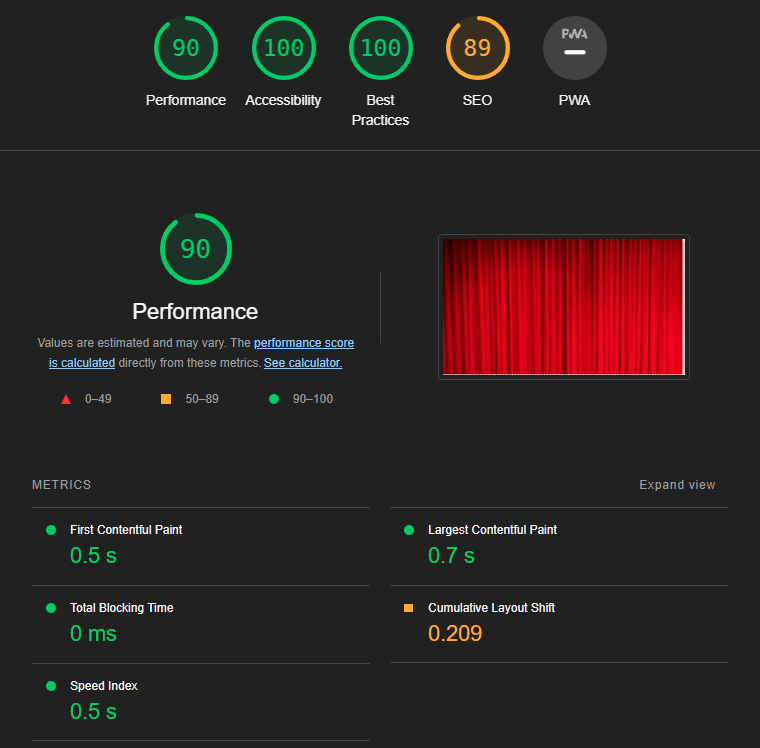

# Amazon Movies Data Dashboard

La práctica consiste en la creación de un dashboard para mostrar de forma visual, en formato gráficos, los datos del data set.
En nuestro caso hemos seleccionado el dataset con información de las películas que encontramos en la plataforma de Amazon Prime Video. Podemos encontrar
una mejor visualización del readME en el siguiente [GitHub](https://github.com/KuTo28/Amazon-Dashboard)

## Table of Contents

- [Instalación](#instalacion)
- [Uso](#uso)
- [Tecnologias](#tecnologias)
- [Estadísticas](#estadisticas)
- [Video](#video)

## Instalación

Descargar la práctica y meterla dentro del `xampp/htdocs`.

## Uso

Se necesitará un software donde se pueda cargar la base de datos, en nuestro caso hemos utilizado [XAMPP](https://www.apachefriends.org/download.html). 
Una vez estamos en phpmyadmin, creamos una base de datos `amazon_movies` y se importa `dataset_amazon_movies.sql`; Esto importará todos los datos de las películas en la base de datos.

Y finalmente abrimos `localhost/Amazon-Dashboard` 

## Tecnologias

Este proyecto se ha realizado usando xampp, html, css y javascript. [XAMPP](https://www.apachefriends.org/download.html) donde guardaremos la base de datos. Para acceder a ello realizaremos una query que devuelve un json con la información solicitada.

JavaScript se ha usado para la creación de los gráficos, para ser más específico mediante el uso de [Highcharts](https://www.highcharts.com/). Para cada gráfico se tiene un archivo javascript. Y tenemos un .js adicional que lo utlizamos para gestionar
las peticiones a la base de datos, así como adecuar los datos para usarlos en las gráficas.

El HTML y CSS se ha usado para estructurar el documento y para el estilo del mismo. Cabe destacar el uso de [Bootstrap](https://getbootstrap.com/) para una elaboración más sencilla de la estructura usando menos líneas de código.

## Estadísticas

Para comprobar la accesibilidad de la página así como su rendimiento, hemos usado [lighthouse](https://web.dev/performance-scoring/). Y este es el resultado:

## Video

Hemos creado un video donde mostramos, la estructura de la base de datos, la arquitectura del código utilizado y mostramos el dashboard en la ejecución de la práctica.
El link del video, lo puedes encontrar en el siguiente enlace, [video](https://youtu.be/9StQrFi_n1M).